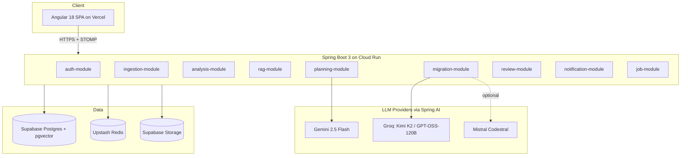
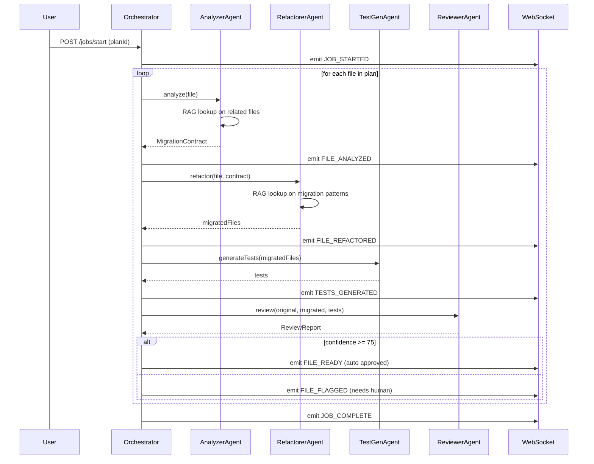

# LegacyForge Architecture

Version 0.1 · Sept 20, 2026
Author: Vinay Babu Machha

## 1. Overview

LegacyForge is a full stack agentic AI platform that migrates legacy Java monoliths (Java 7/8, Struts, Spring MVC 4, JSP) to modern Java 21 plus Spring Boot 3 microservices with an Angular 18 frontend. Migration is not a single LLM call. It is an orchestrated multi-agent pipeline that includes analysis, planning, code generation, test generation, and human review.

This document is the source of truth for architectural decisions during the 12 week build. Anyone reading this should be able to explain what the system does, why the pieces exist, and how they talk to each other.

## 2. Design principles

1. **Modular monolith first, microservices second.** We ship a clean modular monolith through Week 10 and split off the CPU heavy modules (analysis, migration) in Week 11. Premature service extraction is the biggest killer of side projects.
2. **Every agent action is reviewable.** No code is written to a target repo without a reviewer step and a human approval gate. Even if the AI is confident, the human sees the diff.
3. **Provider agnostic AI.** Every LLM call goes through Spring AI's `ChatClient`. Swapping Groq for Gemini or Claude is a config change, not a refactor.
4. **Cost is a first class metric.** Every job tracks token usage per agent, per file, per phase. If we can't measure it, we can't optimize it.
5. **Local dev must be trivial.** `docker compose up` gives you Postgres, Redis, and pgAdmin. No cloud accounts required for backend or frontend dev.

## 3. System diagram



## 4. Backend module breakdown

The backend is a single Spring Boot 3.3 application organized as a modular monolith. Each module is a package with clear public interfaces. Cross module calls go through Spring beans. No direct DB access across modules.

### 4.1 auth-module

- Spring Security 6 with JWT (access + refresh tokens)
- Roles: `USER`, `REVIEWER`, `ADMIN`
- Endpoints: `POST /api/auth/register`, `POST /api/auth/login`, `POST /api/auth/refresh`, `POST /api/auth/logout`
- Password hashing: BCrypt with cost factor 12
- Refresh token rotation on every use, stored hashed in DB

### 4.2 ingestion-module

- Accepts zip uploads (max 100 MB) or GitHub repo URLs
- Uses JGit to clone public GitHub repos into a temp workspace
- Extracts file tree, detects language per file (extension based initially, tree-sitter later)
- Persists repo metadata and uploads blob to Supabase Storage
- Endpoints: `POST /api/repos` (multipart or JSON), `GET /api/repos/{id}`, `GET /api/repos/{id}/tree`

### 4.3 analysis-module

- Reads the repo from storage
- **JavaParser** builds an AST per file
- **JGraphT** builds a class level dependency graph
- **Framework fingerprinter** scans `pom.xml`, `build.gradle`, `web.xml`, `struts-config.xml`, `applicationContext.xml`, plus package imports across the codebase
- Detects: Struts 1/2, Spring MVC 3/4, JSP, JSF, EJB 2/3, Hibernate 3/4, iBATIS, plain Servlets
- Computes per file complexity: cyclomatic complexity (via Sonar rules ported to Java), LOC, dependency count, cognitive complexity
- Output: `AnalysisReport` (persisted) with per file summaries and repo level fingerprint
- Endpoint: `POST /api/repos/{id}/analyze` (async, returns job id)

### 4.4 rag-module

- Chunks source files at method and class boundaries (never mid statement)
- Each chunk carries: full method text, class context (imports, class signature), file path
- Embeddings via Spring AI's `EmbeddingClient` (Ollama `nomic-embed-text` locally, OpenAI `text-embedding-3-small` in prod)
- Storage: pgvector column on `code_chunks` table, ivfflat index
- Retrieval API: `List<CodeChunk> retrieve(String query, int k, RepoId repoId)`
- Also stores a separate "migration patterns" collection: curated Struts to Spring Boot before/after examples, JSP to Angular component mappings, etc. This gives the RefactorerAgent few shot examples on demand.

### 4.5 planning-module

- Consumes the analysis report and framework fingerprint
- Sends a structured prompt to **Gemini 2.5 Flash** (chosen for its 1M token context so the whole analysis fits in one call)
- Prompt asks for: phased migration plan, dependency order, per file risk score (1 to 5), estimated effort, rollback checkpoints
- Output: `MigrationPlan` entity with N phases, each containing an ordered file list
- Users can edit the plan in the UI before execution starts

### 4.6 migration-module (the star)

The heart of LegacyForge. Runs the actual migration.

**State machine** (Spring Statemachine):
`PENDING → ANALYZING → REFACTORING → TESTING → REVIEWING → APPROVED | FLAGGED | FAILED`

Each file cycles through this state machine independently, with parallelism controlled by a semaphore (default 3 concurrent files).

**Agents** (all Spring beans, all use `ChatClient` with tool calling):

1. **AnalyzerAgent**
   - Input: file path plus repo context
   - Reads the file, retrieves related files via RAG (`getRelatedFiles` tool)
   - Outputs a JSON `MigrationContract`: `{intent, dependencies, targetPattern, risks, testStrategy}`

2. **RefactorerAgent**
   - Input: source file plus `MigrationContract` plus retrieved migration patterns
   - Tools: `getFileContents(path)`, `getMigrationPatterns(fromFramework, toFramework)`, `getTargetProjectStructure()`
   - Outputs the migrated file(s). One legacy file may produce multiple modern files (e.g. a Struts action becomes a `@RestController` plus `@Service` plus DTO)

3. **TestGeneratorAgent**
   - Input: migrated files plus original behavior contract
   - Produces JUnit 5 tests, Mockito for unit tests, Testcontainers for DB integration tests
   - Enforces minimum 70% branch coverage per file (measured with JaCoCo during CI)

4. **ReviewerAgent**
   - Input: original file plus migrated file plus tests
   - Runs a semantic diff check: does the new code preserve observed behavior?
   - Outputs a `ReviewReport`: `{confidence: 0-100, concerns: [...], suggestedEdits: [...]}`
   - If confidence < 75, file is flagged for mandatory human review

**Orchestrator** coordinates the pipeline, tracks state, emits WebSocket events on every state transition, handles retries (max 2 per agent), and enforces the parallelism cap.

### 4.7 review-module

- Generates unified diffs with `java-diff-utils`
- Persists reviewer comments, approvals, rollbacks
- Emits Git-ready patches
- Endpoint: `POST /api/jobs/{id}/files/{path}/approve`, `POST .../reject`, `POST .../rollback`

### 4.8 notification-module

- WebSocket plus STOMP over `/ws` endpoint
- Topics: `/topic/jobs/{jobId}`, `/topic/users/{userId}`
- Also sends email via Spring Mail on job completion or failure (Resend as SMTP provider, free tier)

### 4.9 job-module

- Wraps long running work in async jobs
- Job queue: Upstash Redis with a simple pending/running/done model (we skip Kafka to keep infra light; Redis Streams could be a Week 11 upgrade)
- Every job has: `id`, `type`, `state`, `progress`, `costTokens`, `createdBy`, `startedAt`, `finishedAt`

## 5. Frontend feature breakdown

Angular 18 app, standalone components, signals for local state, NgRx SignalStore for feature state.

```
frontend/src/app/
├── core/
│   ├── auth/         (guards, JWT interceptor, refresh logic)
│   ├── api/          (typed HTTP clients per backend module)
│   ├── ws/           (STOMP client wrapper)
│   └── layout/       (shell, sidenav, toolbar)
├── shared/           (buttons, dialogs, pipes, code-block)
└── features/
    ├── auth/         (login, register)
    ├── dashboard/    (job list, job cards, filters)
    ├── wizard/       (new migration: upload, target, confirm)
    ├── job-detail/
    │   ├── analysis-tab/
    │   ├── plan-tab/
    │   ├── execution-tab/    (live agent stream)
    │   ├── review-tab/       (diff viewer)
    │   └── deploy-tab/
    └── settings/     (BYO API keys, preferences)
```

**Key UI decisions**
- Monaco Editor for all code views. Same editor as VS Code, users trust it instantly.
- Diff viewer: side by side by default, unified diff toggle.
- Agent execution tab has a live "activity feed" that shows each agent's step in real time. This is the wow factor of the demo.
- Colors and severity: green (approved), amber (flagged for review), red (failed), grey (pending).

## 6. Data model

Simplified. Actual DDL lives in Flyway migrations under `backend/src/main/resources/db/migration/`.

```
users(id, email, password_hash, role, created_at)
refresh_tokens(id, user_id, token_hash, expires_at, revoked)

repos(id, user_id, name, source_type, source_url, blob_path, created_at)
files(id, repo_id, path, language, size_bytes, sha256)

analysis_reports(id, repo_id, framework_fingerprint jsonb, summary jsonb, created_at)
file_analyses(id, analysis_id, file_id, complexity, dependencies jsonb, findings jsonb)

code_chunks(id, repo_id, file_id, chunk_text, chunk_type, embedding vector(1536))
migration_patterns(id, from_framework, to_framework, before_text, after_text, embedding vector(1536))

migration_plans(id, repo_id, plan jsonb, status, created_at)
migration_jobs(id, plan_id, user_id, state, progress_pct, cost_tokens, started_at, finished_at)
file_migrations(id, job_id, file_id, state, contract jsonb, migrated_files jsonb, review_report jsonb, cost_tokens)

reviews(id, file_migration_id, reviewer_id, action, comment, created_at)
```

Indexes: `code_chunks (repo_id)` plus `code_chunks USING ivfflat (embedding vector_cosine_ops)`, `file_migrations (job_id, state)`, `migration_jobs (user_id, state)`.

## 7. Agent flow (sequence)



## 8. API surface (selected)

| Method | Path | Purpose |
| :--- | :--- | :--- |
| POST | `/api/auth/register` | New user |
| POST | `/api/auth/login` | Get JWT plus refresh |
| POST | `/api/repos` | Upload zip or GitHub URL |
| GET | `/api/repos/{id}` | Repo metadata |
| POST | `/api/repos/{id}/analyze` | Kick off analysis (async) |
| GET | `/api/repos/{id}/analysis` | Latest analysis report |
| POST | `/api/repos/{id}/plan` | Generate migration plan |
| GET | `/api/plans/{id}` | Read plan |
| PATCH | `/api/plans/{id}` | Edit plan phases |
| POST | `/api/jobs` | Start a migration job |
| GET | `/api/jobs/{id}` | Job status |
| GET | `/api/jobs/{id}/files` | Per file migration state |
| POST | `/api/jobs/{id}/files/{path}/approve` | Approve a migrated file |
| POST | `/api/jobs/{id}/files/{path}/reject` | Reject with comment |
| POST | `/api/jobs/{id}/deploy` | Generate deploy artifacts plus PR |
| WS | `/ws` | STOMP endpoint for live updates |

## 9. Deployment topology

| Component | Where | Cost |
| :--- | :--- | :--- |
| Angular SPA | Vercel Hobby | Free |
| Spring Boot API | Google Cloud Run (min 0, max 2 instances) | Free (2M req/mo) |
| Postgres + pgvector | Supabase Free | Free (500 MB) |
| Redis | Upstash Free | Free (10K commands/day) |
| Object storage | Supabase Storage | Free (1 GB) |
| Container registry | GitHub Container Registry | Free (public) |
| CI/CD | GitHub Actions | Free (public repo) |
| LLM inference | Groq plus Gemini free tiers | Free |
| Observability | Grafana Cloud free tier | Free (10K series) |
| Email | Resend free tier | Free (100 emails/day) |

**Total monthly infra cost: $0.**

**Deploy flow**
1. Push to `main`
2. GitHub Actions runs tests plus build
3. Backend: Docker image built, pushed to GHCR, `gcloud run deploy` triggered
4. Frontend: Vercel auto builds from the push
5. Flyway runs on backend startup, applies pending migrations

## 10. Security model

- All endpoints except `/api/auth/*` and `/actuator/health` require JWT
- CORS: allowlist `https://legacyforge.vercel.app` and `http://localhost:4200`
- CSRF: disabled (stateless JWT API)
- Rate limiting: Bucket4j per user, 60 req/min per endpoint group
- Prompt injection defense: uploaded code is treated as data, never mixed into system prompts. Agent prompts use structured templates with typed variables.
- Uploaded zips scanned for path traversal (`../`), symlinks, and size bombs before extraction
- LLM output is never executed. Generated code is written to sandbox blobs and only released to the user's repo after human approval.
- Secrets in `.env` locally, GitHub Actions secrets in CI, Cloud Run env vars in prod. Never checked in.
- Dependency scanning: Trivy runs on every PR

## 11. Cost model per migration

Estimated tokens for migrating a medium (200 file) Java 8 app:

| Agent | Tokens per file | Files | Total tokens |
| :--- | :--- | :--- | :--- |
| Analyzer | ~4K in + 1K out | 200 | 1.0M |
| Refactorer | ~8K in + 4K out | 200 | 2.4M |
| TestGen | ~6K in + 3K out | 200 | 1.8M |
| Reviewer | ~10K in + 2K out | 200 | 2.4M |
| Planning (once) | ~50K in + 5K out | 1 | 55K |
| **Total** | | | **~7.7M tokens** |

Groq free tier gives 1,000 requests per day per model. With batching plus smart caching we fit inside the free tier for repos up to ~50 files. Larger repos: users can BYO OpenAI or Anthropic key in settings.

## 12. Observability

Every request gets:
- A trace ID (W3C traceparent) propagated through all agent calls
- Structured JSON logs (Logback plus logstash encoder) shipped to Loki
- Metrics (Prometheus): request count, latency, LLM token spend, agent success rate, per file wall time
- Traces (Tempo): full agent pipeline as one trace, with each agent call as a span

Grafana Cloud dashboard shows:
- Jobs in flight
- LLM tokens spent (today, this week, this month)
- Per agent success rate
- Median wall time per file
- Error rate by module

## 13. Testing strategy

- **Unit**: JUnit 5 plus Mockito, run on every commit
- **Integration**: Testcontainers spins up Postgres plus Redis, run on every PR
- **Contract**: Spring Cloud Contract for the API layer, consumed by the Angular client
- **E2E**: Playwright suite that runs the full "upload, analyze, plan, migrate one file, review, approve" flow against a real Groq key in nightly CI
- **Load**: k6 script that simulates 20 concurrent users starting migrations, run before Week 12 demo

Target: 70% branch coverage on backend, 60% on frontend.

## 14. Out of scope (v1)

Explicitly not in the 12 week build. Documented so we don't scope creep:

- Migrating non Java sources (C#, VB6, COBOL). Future.
- Real time collaborative review (two humans on the same diff). Nice to have.
- Fine tuned migration models. We're using off the shelf frontier models.
- Enterprise SSO (SAML, OIDC). JWT is enough for portfolio.
- Multi tenant billing. This is a portfolio project, not a SaaS.

## 15. Change log

| Date | Version | Change |
| :--- | :--- | :--- |
| 2026-09-20 | 0.1 | Initial architecture draft |
